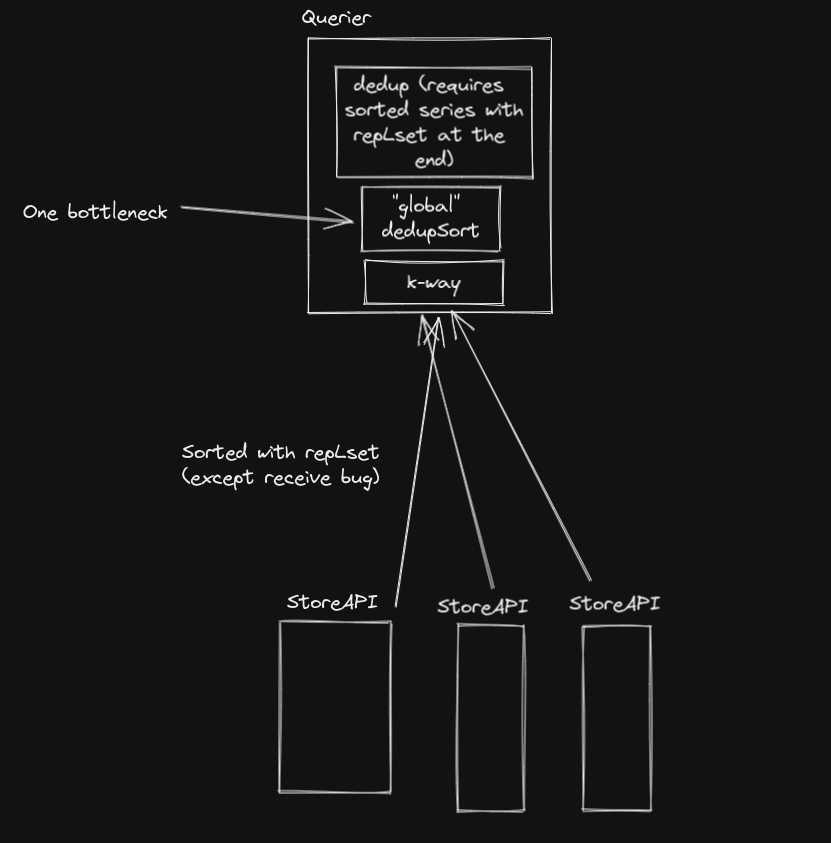

## Avoid Global Sort on Querier Select

* **Owners:**
    * @bwplotka, @fpetkovski

* **Related Tickets:**
    * https://github.com/thanos-io/thanos/issues/5719
    * https://github.com/thanos-io/thanos/commit/043c5bfcc2464d3ae7af82a1428f6e0d6510f020
    * https://github.com/thanos-io/thanos/pull/5796 also alternatives (https://github.com/thanos-io/thanos/pull/5692)

> TL;DR: We propose solution that allows saving query and query_range latency on common setups when deduplication on and data replication. Initial benchmarks indicate ~20% latency improvement for data replicated 2 times.
>  
> To make it work we propose making Store API replica labels aware, guarded by check field propagate via Info. This means replica labels will be returned in separate set to normal time series labels. We also propose clear strategy in misconfigured environments.     

## Glossary

**replica**: We use term "replica labels" as a subset of (or equal to) "external labels": Labels that indicate unique replication group for our data, usually taken from the metadata about origin/source.

## Why

Currently, we spent a lof of storage selection CPU time on resorting resulting time series needed for deduplication (exactly in [`sortDedupLabels`](https://github.com/thanos-io/thanos/blob/main/pkg/query/querier.go#L400)). However, given distributed effort and current sorting guarantees of StoreAPI there is potential to reduce sorting effort or/and distribute it to leafs or multiple threads. 

### Pitfalls of the current solution

TBD

## Goals

Goals and use cases for the solution as proposed in [How](#how):

* Avoid expensive global sort of all series before passing them to PromQL engine in Querier.
* Clear the behaviour in tricky cases when there is an overlap of replica labels between what's in TSDB vs what's attached as external labels.
* Ensure this change can be rolled out in compatible way. 

## Non-Goals

* Allow consuming series in streamed way in PromQL engine.
  * While this pitfall (global sort) blocks the above idea, it's currently still more beneficial to pull all series upfront (eager approach) as soon as possible. This is due to current PromQL architecture which requires info upfront for query planners and execution. We don't plan to change it yet, thus no need to push explicitly for that. 

## How

TBD

## Alternatives

TBD

## Action Plan

The tasks to do in order to migrate to the new idea.

* [ ] Task one <gh issue="">
* [ ] Task two <gh issue=""> ...
